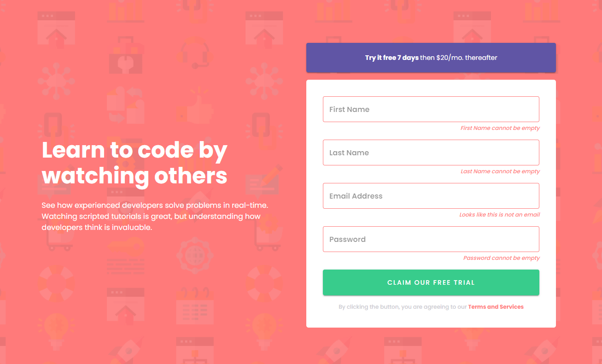

<h1 align="center">
   
  Intro component with sign-up form challenge hub
</h1>

<h3 align="center">
<strong>Project based on <a href="https://www.youtube.com/watch?v=x4FdZd2-_uU" target="_blank">Frontend Mentor Challenges </a></strong>
</h3>

  
  
  
  
   
   
  <a href="#space_invader-technologies">Technologies</a>
   
   
  
   
   
  <!-- <a href="https://shiga-signup-form.netlify.app/" target="_blank">
    VISIT
  </a> -->

## :space_invader: Technologies

- React
- Typescript
- [Material UI](https://mui.com/pt/)
